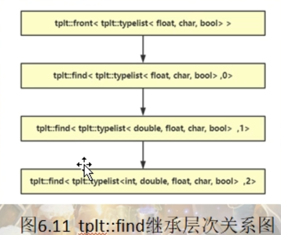
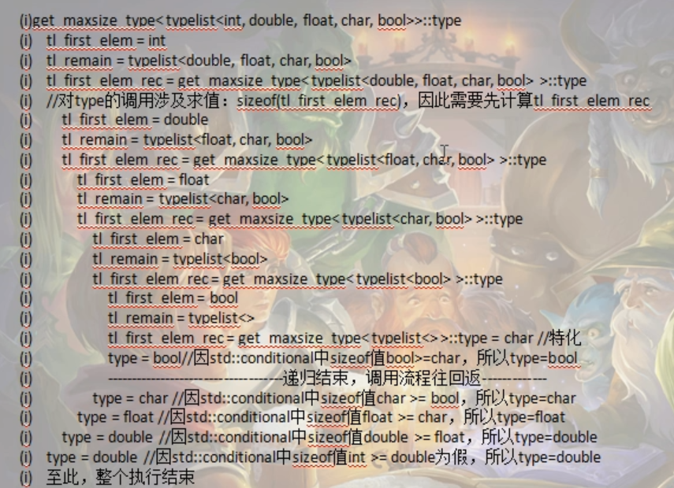

# typelist的实现（类型计算的范例）

《Modern C++ Design》-(c++设计新思维)，在这本书中通过设计了一个叫做Loki的库实现typelist（采用列表头 + 嵌套列表技术来实现，因为03年c++还不支持可变参模板）

typelist是一个类模板，是用来操作一大堆类型的c++容器，就像c++标准库中的list容器（能对各种数值提供各种基本操作）

typelist与之类似，但是他操作的不是数值，而是针对类型进行操作。所以typelist简单来说就是一个类型容器，能够对类型提供一系列操作，把类型当成数据来操作

从实现上来讲，typelist是一个类模板，中文名“类型列表”。该类模板表示一个列表，在该列表中存放一堆类型

之前对于元编程的学习，了解到，元编程很大一部分是针对类型进行计算的

## 设计和基本操作接口（算法）

可以考虑把typelist相关的定义放到一个命名空间中，避免全局命名空间被污染

### 取得typelist中的第一个元素（front）

既然typelist是一个类型列表，也就是他是保存类型的容器，那么毫无疑问，取得typelist中的第一个元素肯定也是一个类型

```c++
// ------------------------------------------------------------------------------
    // 取得typelist中的第一个元素（front）
    // 写一个类模板，他的能力就是从typelist中取得第一个元素
    // TPLT 就代表整个typelist<...>类型
    // 泛化版本，因为用不到，所以只需要声明，
    template<class TPLT>
    class front;
    
    // 特化版本
    // 这里要尤其注意这里特化版本的写法，因为泛化版本中只有一个类型参数 TPLT，
    // 所以在特化版本，front后面的尖括号中也应该要保证，只能有一个具体类型 typelist<First, Other...>
    // 然后，在根据特化版本中front后面的<>中的类型，来确定模板中应该有哪些模板参数，即 <class First, class... Other>
    template<class First, class... Other>
    class front<typelist<First, Other...>>
    {
    public:
        using type = First;
    };
```

### 取得typelist容器中元素的数量（size）

```c++
// 取得typelist容器中元素的数量（size）
    // 泛化版本
    template<class TPLT>
    class size;
    
    // 特化版本
    template<class ...Args>
    class size<typelist<Args...>>
    {
    public:
        static inline size_t value = sizeof...(Args);
    };
```

### 从typelist中移除第一个元素（pop front）

```c++
// 从typelist中移除第一个元素（pop front）
    // 泛化版本
    template<class TPLT>
    class pop_front;
    
    // 特化版本
    template<class First, class... Other>
    class pop_front<typelist<First, Other...>>
    {
    public:
        using type = typelist<Other...>;
    };
```

### 向typelist的开头和结尾插入一个元素（push_front、push_back）

```C++
// 向typelist的开头和结尾插入一个元素（push_front、push_back）
    // push_front
    // 泛化版本
    // NewElem 要插入的新类型
    template<class TPLT, class NewElem>
    class push_front;
    
    // 特化版本
    template<class... Args , class NewElem>
    class push_front<typelist<Args...>, NewElem>
    {
    public:
        using type = typelist<NewElem, Args...>;
    };
    
    // push_back
    // 泛化版本
    // NewElem 要插入的新类型
    template<class TPLT, class NewElem>
    class push_back;
    
    // 特化版本
    template<class... Args , class NewElem>
    class push_back<typelist<Args...>, NewElem>
    {
    public:
        using type = typelist<Args..., NewElem>;
    };
```


### 替换typelist的开头元素（replace_front）

```C++
// 替换typelist的开头元素（replace_front）
    // 泛化版本
    // NewElem 表示要替换进来的那个类型
    template<class TPLT, class NewElem>
    class replace_front;
    
    // 特化版本
    template<class First, class... Other, class NewElem> 
    class replace_front<typelist<First, Other...>, NewElem>
    {
    public:
        using type = typelist<NewElem, Other...>;
    };
```


### 判断typelist是否为空（is_empty)

```C++
 // 判断typelist是否为空（is_empty)
    // 泛化版本
    template<class TPLT>
    class is_empty : public std::false_type
    {};
    
    // 特化版本
    template<>
    class is_empty<typelist<>> : public std::true_type
    {};
```

main中调用上述功能接口，执行的结果

```c++
int main()
{
    std::cout << typeid(tplt::front<TPL_NM1>::type).name() << std::endl;
    // int 
    // 如果typelist中不包含任何元素，那么使用当前这个front来取，是会报编译错误的（报未定义错误）
    // 因为对于这种空的typelist，在进行front调用的时候，是不满足特化版本的，因为特化版本时要求至少要有一个元素的，
    // 所以这种情况下，他只能去调用front的泛化版本，但是泛化版本因为只是进行声明，没有实现定义，所以就报未定义错误
    // std::cout << typeid(tplt::front<TPL_NM2>::type).name() << std::endl;
    
    // 所以其实这里是故意不写泛化版本的，这样做了之后，反而达到了检查错误的效果（因为这里对于没有类型的typelist（空typelist）你却要去返回一个类型）
    // 这种写法本身就是错误的。这种错误在编译的时候就能发现这个错误
    
    // ------------------------------------------------------------------------------
    std::cout << tplt::size<TPL_NM1>::value << std::endl;
    // 5
    std::cout << tplt::size<TPL_NM2>::value << std::endl;
    // 0
    
    // ------------------------------------------------------------------------------
    std::cout << typeid(tplt::pop_front<TPL_NM1>::type).name() << std::endl;
    // double
    std::cout << tplt::size<tplt::pop_front<TPL_NM1>::type>::value << std::endl;
    // 4
    
    // ------------------------------------------------------------------------------
    std::cout << typeid(tplt::push_front<TPL_NM1, bool>::type).name() << std::endl;
    // bool
    std::cout << tplt::size<tplt::push_front<TPL_NM1, bool>::type>::value << std::endl;
    // 6
    
    // ------------------------------------------------------------------------------
    std::cout << typeid(tplt::push_back<TPL_NM1, bool>::type).name() << std::endl;
    // int
    std::cout << tplt::size<tplt::push_back<TPL_NM1, bool>::type>::value << std::endl;
    // 6
    
    // ------------------------------------------------------------------------------
    std::cout << typeid(tplt::replace_front<TPL_NM1, std::string>::type).name() << std::endl;
    // std::string
    std::cout << tplt::size<tplt::replace_front<TPL_NM1, std::string>::type>::value << std::endl;
    // 5
    
    // 当然，对于这种替换操作，我们也可以直接使用pop + push 达到一样的效果
    using TnpType = tplt::push_front<tplt::pop_front<TPL_NM1>::type, unsigned>::type;
    std::cout << tplt::size<TnpType>::value << std::endl;
    // 5
    std::cout << typeid(TnpType).name() << std::endl;
    // unsigned
    
    // ------------------------------------------------------------------------------
    std::cout << tplt::is_empty<TPL_NM2>::value << std::endl;
    // 1
    std::cout << tplt::is_empty<TPL_NM1>() << std::endl;
    // 0
    
    return 0;
}
```


## 扩展操作接口（算法）

### 根据索引号查找typelist的某个元素（find）

```c++
// ------------------------------------------------------------------------------
    // 根据索引号查找typelist的某个元素（find）
    // 因为要找到满足索引号对应的类型，所以不可避免的需要用到递归这种编程手法，递归的此时应该是从索引号开始
    // 每次递归减1，直到0结束。也就是递归是以我们下面的这个特化版本作为出口（递归结束），
    // 那这里这个特化版本的find类模板就应该以front做为父类比较合适
    // 
    // 然后泛化版本，每次递归我们要考虑移除第一个元素，每次移除一个，递归下去总会移除到我们索引号对应的那个元素上去
    // 也就是说，每次递归我们都要想办法利用pop_front移除第一个元素，同时索引计数减1
    
    // 泛化版本
    template<class TPLT, unsigned int V>
    class find : public find<class pop_front<TPLT>::type, V-1>
    {};
    
    // 特化版本
    // 索引值每次递归减1，减少到0的时候，就找到我们索引指向的那个类型值了，也就是这个开头元素
    // 然后继承自front，那front返回的那个值就是我们要取的那个
    // 那这个时候，特化版本就成立
    template<class TPLT>
    class find<TPLT, 0> : public front<TPLT>
    {};
```

find继承关系图



### 遍历typelist找到sizeof值最大的元素（get_maxsize_type）


递归实例化流程



### 颠倒（翻转）一个typelist中的元素的顺序（reverse）

## typelist的老式设计与typelist的思考