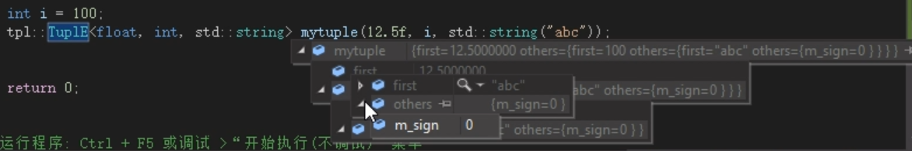

# 元组（tuple）实现

## 重要基础知识回顾

### 左值、右值、左值引用、右值引用

```c++
namespace _nmsp1
{
    void tsFunc1(int& j)
    {}
    
    void tsFunc2(const int& j)
    {}
    
    void tsFunc3(int&& j)
    {}
    
    void tsFunc4(const int&& j)
    {}
    
    void tsFunc5(int j)
    {}
    
    void func()
    {
        // 左值。右值、左值引用，右值引用
        
        int i = 10;
        // i 是左值，10是右值
        
        // 然后左值引用，谈到引用，就必须有一个地址符（&）
        int& j = i;
        // j 就是一个左值引用，那么给这个左值引用赋值的时候（也就是等号右侧），必须也得是一个左值
        // int& j = 10; // 这个就不行，因为左值引用只能接左值，而10是右值，不能用一个右值给左值引用j赋值
        
        // 同理，当左值引用作为一个函数形参的时候，那么你传递的实参就得是一个左值
        tsFunc1(i);
        // tsFunc1(10); // 语法错，10 是右值，不可以作为实参传递给左值引用形参
        
        // 所以记住：左值引用只能绑定到左值上，编译器会且只会为const引用 （const &）开绿灯，可以让其绑定左值，也可以让其绑定右值
        // const例外情况（加上const，如下就没有语法错）
        
        const int& k = 10;
        tsFunc2(100);
        
        // 右值引用
        int&& l = 10;
        // l就是一个右值引用，给右值引用赋值的时候（也就是等号右侧），必须也得是一个右值
        // int&& l = i; // 这个就不行，因为右值引用只能接右值，i是左值，不能用一个左值给右值引用l赋值
        
        // 同理，当右值引用作为一个函数形参的时候，那么你传递的实参就得是一个右值
        tsFunc3(100);
        // tsFunc3(i);  // 语法错，i是左值，不可以作为实参传递给右值引用形参
        
        // 所以记住：右值引用只能绑定到右值上
        
        
        int m = i;
        // 这里m是一个左值引用还是右值引用？
        // 既不是左值引用，也不是右值引用，引用必须得有(&)地址符
        // 那既然他这里既不是左值，又不是右值，那么这里你无论给一个左值还是右值进行赋值，都不会报错。都是可以的
        // 展开了讲，如果你把这个m作为函数形参，那么你调用这个函数的时候，无论传递的是左值还是右值，都没有问题
        tsFunc5(12);
        tsFunc5(i);
        
    }
    
}
```

**左值引用**

先看一下传统的左值引用。

```c++
int a = 10;
int &b = a;  // 定义一个左值引用变量
b = 20;      // 通过左值引用修改引用内存的值
```

*左值引用在汇编层面其实和普通的指针是一样的；*定义引用变量必须初始化，因为引用其实就是一个别名，需要告诉编译器定义的是谁的引用。

```c++
int &var = 10;
```

上述代码是无法编译通过的，因为10无法进行取地址操作，无法对一个立即数取地址，因为立即数并没有在内存中存储，而是存储在寄存器中，可以通过下述方法解决：

```c++
const int &var = 10;
```

使用常引用来引用常量数字10，因为此刻内存上产生了临时变量保存了10，这个临时变量是可以进行取地址操作的，因此var引用的其实是这个临时变量，相当于下面的操作：

```c++
const int temp = 10; 
const int &var = temp;
```

根据上述分析，得出如下结论：

- 左值引用要求右边的值必须能够取地址，如果无法取地址，可以用常引用；
  但使用常引用后，我们只能通过引用来读取数据，无法去修改数据，因为其被const修饰成常量引用了。

那么C++11 引入了右值引用的概念，使用右值引用能够很好的解决这个问题。

**右值引用**

C++对于左值和右值没有标准定义，但是有一个被广泛认同的说法：

- 可以取地址的，有名字的，非临时的就是左值；
- 不能取地址的，没有名字的，临时的就是右值；

可见立即数，函数返回的值等都是右值；而非匿名对象(包括变量)，函数返回的引用，const对象等都是左值。

从本质上理解，创建和销毁由编译器幕后控制，程序员只能确保在本行代码有效的，就是右值(包括立即数)；而用户创建的，通过作用域规则可知其生存期的，就是左值(包括函数返回的局部变量的引用以及const对象)。

定义右值引用的格式如下：

```c++
类型 && 引用名 = 右值表达式;
```

右值引用是C++ 11新增的特性，所以C++ 98的引用为左值引用。右值引用用来绑定到右值，绑定到右值以后本来会被销毁的右值的生存期会延长至与绑定到它的右值引用的生存期。

```c++
int &&var = 10;
```

在汇编层面右值引用做的事情和常引用是相同的，即产生临时量来存储常量。但是，唯一 一点的区别是，右值引用可以进行读写操作，而常引用只能进行读操作。

右值引用的存在并不是为了取代左值引用，而是充分利用右值(特别是临时对象)的构造来减少对象构造和析构操作以达到提高效率的目的。

用C++实现一个简单的顺序栈：

```c++
class Stack
{
public:
    // 构造
    Stack(int size = 1000) 
	:msize(size), mtop(0)
    {
	cout << "Stack(int)" << endl;
	mpstack = new int[size];
    }
	
    // 析构
    ~Stack()
    {
	cout << "~Stack()" << endl;
	delete[]mpstack;
	mpstack = nullptr;
    }
	
    // 拷贝构造
    Stack(const Stack &src)
	:msize(src.msize), mtop(src.mtop)
    {
	cout << "Stack(const Stack&)" << endl;
	mpstack = new int[src.msize];
	for (int i = 0; i < mtop; ++i) {
	    mpstack[i] = src.mpstack[i];
	}
    }
	
    // 赋值重载
    Stack& operator=(const Stack &src)
    {
	cout << "operator=" << endl;
	if (this == &src)
     	    return *this;

	delete[]mpstack;

	msize = src.msize;
	mtop = src.mtop;
	mpstack = new int[src.msize];
	for (int i = 0; i < mtop; ++i) {
	    mpstack[i] = src.mpstack[i];
	}
	return *this;
    }

    int getSize() 
    {
	return msize;
    }
private:
    int *mpstack;
    int mtop;
    int msize;
};

Stack GetStack(Stack &stack)
{
    Stack tmp(stack.getSize());
    return tmp;
}

int main()
{
    Stack s;
    s = GetStack(s);
    return 0;
}
```

运行结果如下：

```c++
Stack(int)             // 构造s
Stack(int)             // 构造tmp
Stack(const Stack&)    // tmp拷贝构造main函数栈帧上的临时对象
~Stack()               // tmp析构
operator=              // 临时对象赋值给s
~Stack()               // 临时对象析构
~Stack()               // s析构
```

为了解决浅拷贝问题，为类提供了自定义的拷贝构造函数和赋值运算符重载函数，并且这两个函数内部实现都是非常的耗费时间和资源(首先开辟较大的空间，然后将数据逐个复制)，我们通过上述运行结果发现了两处使用了拷贝构造和赋值重载，分别是tmp拷贝构造main函数栈帧上的临时对象、临时对象赋值给s，其中tmp和临时对象都在各自的操作结束后便销毁了，使得程序效率非常低下。

那么我们为了提高效率，是否可以把tmp持有的内存资源直接给临时对象？是否可以把临时对象的资源直接给s？

在C++11中，我们可以解决上述问题，方式是提供带右值引用参数的拷贝构造函数和赋值运算符重载函数.

```c++
// 带右值引用参数的拷贝构造函数
Stack(Stack &&src)
    :msize(src.msize), mtop(src.mtop)
{
    cout << "Stack(Stack&&)" << endl;

    /*此处没有重新开辟内存拷贝数据，把src的资源直接给当前对象，再把src置空*/
    mpstack = src.mpstack;  
    src.mpstack = nullptr;
}

// 带右值引用参数的赋值运算符重载函数
Stack& operator=(Stack &&src)
{
    cout << "operator=(Stack&&)" << endl;

    if(this == &src)
        return *this;
	    
    delete[]mpstack;

    msize = src.msize;
    mtop = src.mtop;

    /*此处没有重新开辟内存拷贝数据，把src的资源直接给当前对象，再把src置空*/
    mpstack = src.mpstack;
    src.mpstack = nullptr;

    return *this;
}
```

运行结果如下：

```c++
Stack(int)             // 构造s
Stack(int)             // 构造tmp
Stack(Stack&&)         // 调用带右值引用的拷贝构造函数，直接将tmp的资源给临时对象
~Stack()               // tmp析构
operator=(Stack&&)     // 调用带右值引用的赋值运算符重载函数，直接将临时对象资源给s
~Stack()               // 临时对象析构
~Stack()               // s析构
```

程序自动调用了带右值引用的拷贝构造函数和赋值运算符重载函数，使得程序的效率得到了很大的提升，因为并没有重新开辟内存拷贝数据。

```c++
mpstack = src.mpstack;  
```

可以直接赋值的原因是临时对象即将销毁，不会出现浅拷贝的问题，我们直接把临时对象持有的资源赋给新对象就可以了。

所以，临时量都会自动匹配右值引用版本的成员方法，旨在提高内存资源使用效率。

带右值引用参数的拷贝构造和赋值重载函数，又叫移动构造函数和移动赋值函数，这里的移动指的是把临时量的资源移动给了当前对象，临时对象就不持有资源，为nullptr了，实际上没有进行任何的数据移动，没发生任何的内存开辟和数据拷贝。

### std::move究竟干了什么

```c++
namespace _nmsp2
{
    // std::move究竟干了什么
    // std::move 类型装换函数，他的能力就是把一个左值转成右值，如果原来是一个右值，那么没有变化
    // 我们可以认为std::move的结果是一个右值引用类型
    
    void func()
    {
        int i = 10;
        // int&& j = i;    // 报语法错
        int&& j = std::move(i);
        // 将左值转为右值，就可以将i赋给j了
        // 但是注意，这个时候，你把左值i转成右值，然后赋给右值引用j，就相当于把i绑定到j上了
        // 那个这个时候，如果j发生变化，也就相当于i发生变化
        j = 100;
        std::cout << i << std::endl;
        // 100
    }
}
```

std::forward 也是一个类型装换函数（函数模板）

那他和std::move有什么区别？

首先使用上，他比std::move更复杂。std::forward首先他会看后面尖括号<>中的内容，尖括号中如果是一个右值引用，那么std::forward就能保证最终结果是右值。 如果是左值，那么最终就保证是左值。所以,std::forward根本不会管你圆括号（实参）里是什么类型，他只看你尖括号中是什么类型就给你转成什么类型

std::forward有两个明显的作用

- 1）提高程序运行效率
- 2）用于完美转发

```c++
namespace _nmsp3
{
    // std::forward 也是一个类型装换函数（函数模板）
    // 那他和std::move有什么区别？
    // 首先使用上，他比std::move更复杂
    // std::forward首先他会看后面尖括号<>中的内容，尖括号中如果是一个右值引用，那么std::forward就能保证最终结果是右值
    // 如果是左值，那么最终就保证是左值。
    // 所以,std::forward根本不会管你圆括号（实参）里是什么类型，他只看你尖括号中是什么类型就给你转成什么类型
    
    // std::forward有两个明显的作用
    // 1）提高程序运行效率
    // 2）用于完美转发
    
    void func()
    {
        int i = 19;
        int&& m = std::forward<int&&>(i);
        // std::forward首先他会看后面尖括号<>中的内容，这里是一个int&&，右值引用类型，
        // 根据右值引用类型绑右值，std::forward在这里的使命就是保证std::forward<int&&>(i)
        // 这一串最终的结果是右值
        
        
        // int&& o = std::forward<int&>(100);
        // 语法错，因为 std::forward<int&>(100) 把100转成左值了，然后把左值赋给右值引用就编译报错
    
        // int& p = std::forward<int&&>(100);
        // 同理一样，因为 std::forward<int&&>(100) 把100转成右值了，然后把右值赋给左值引用就编译报错
    
        
        int&& q = std::forward<int>(i);
        // std::forward<>里int 既不是左值引用，也不是右值引用，那么这种情况下，编译器就会把它当做右值引用类型来看待
        // 所以这里就会把i转成右值，然后给右值引用q赋值，所以没问题
        
        
        std::string str1 = "abc";
        std::string str2 = str1;
        // 通过str1这个字符串来构造str2（执行string的拷贝构造函数）
        // str2构造完成后，他里面会保存1分“abc”，然后str1中也保存一份“abc”
        // 这两份“abc”占用的是不同的内存
        
        std::string str3 = std::forward<std::string&&>(str1);
        // 因为，使用std::forward<std::string&&>(str1),这个变成了右值引用类型，就导致调用的是string类的移动构造函数
        // 虽然这里也是通过str1来构造str3，但是这里用到了std::forward，他会把整个这个东西转成右值引用类型
        // 这个时候如果变成右值引用类型，那么在构造str3的时候，就会调用string类的移动构造函数
        // 移动构造函数执行，就会把str1中的“abc”，移动到str3中去了，然后str3中保存的是str1中的那个“abc”
        // 那么这个时候，str1中的那个“abc”就不见了
        std::cout << "str1 ---- " << str1 << std::endl;
        // str1 ---- 
        // 可以看到，并不会打印str1(str1中内容已经变空)
    }
    
    
}
```


### 万能引用（转发引用）

```c++
namespace _nmsp4
{
    // 万能引用（转发引用）
    
    // 形参时右值引用类型，只能接右值
    // void myfunc(int&& tmpv)
    // {}
    
    // 形参时左值引用类型，只能接左值
    // void myfunc(int& tmpv)
    // {}
    
    // 在这个函数模板中，tmpv就是一个万能引用类型(T必须是一个类型模板参数，然后T前面不能加任何修饰符)
    // 即：你在调用这个函数模板的时候，你传递的实参既可以是左值，又可以是右值
    template<class T>
    void myfunc(T&& tmpv)
    {
        using boost::typeindex::type_id_with_cvr;
        std::cout << "T = " << type_id_with_cvr<T>().pretty_name() << std::endl;
        std::cout << "tmpv的类型 = " << type_id_with_cvr<decltype(tmpv)>().pretty_name() << std::endl;
    }
    
    template<class T>
    class TmpClass
    {
    public:
        // 注意这里，虽然这个构造函数他的参数类型也是T&&,但是这里并不是万能引用类型
        // TmpClass(T&& tmpvalue)
        // {
        //     std::cout << "TmpClass::TmpClass()执行了" << std::endl;
        // }
        
        // 那我们把这个构造函数重写，改造成构造函数模板
        // 那这个时候，这里的tmpvalue就是万能引用类型
        template<class U>
        TmpClass(U&& tmpvalue)
        {
            std::cout << "TmpClass::TmpClass()执行了" << std::endl;
        }
    };
    
    void func()
    {
        int i = 10;
        int& j = i;
        int&& k = 100;
        
        myfunc(i);
        // T = int&
        // tmpv的类型 = int&
        myfunc(j);
        // T = int&
        // tmpv的类型 = int&
        myfunc(k);
        // T = int&
        // tmpv的类型 = int&
        myfunc(100);
        // T = int
        // tmpv的类型 = int&&
        
        
        TmpClass<int> a(10);    // 这行可以
        // TmpClass::TmpClass()执行了
        
        // TmpClass<int> b(j);     // 但是这行并不行（这也就证明了TmpClass的构造函数哪里，并不是万能引用类型）
        TmpClass<int> b(j);     // 将构造函数改造成构造函数模板，就变成了万能引用，那这个时候就可以正常构造了
        // TmpClass::TmpClass()执行了
        
    }
}
```


### 完美转发

```c++
namespace _nmsp5
{
    // 完美转发
    // 设想一下，有一个函数，他的形参是一个右值引用
    // 那如果我们要调用这个函数的话，实参就必须是一个右值
    void lastfunc(int&& tmpv)
    {}
    
    // 这个时候添加一个中间转发函数，把调用的实参传递给这个中间转发函数，然后再由这个转发函数调用我们上面的这个函数
    // 按照经验，这种转发函数一般都是设计成函数模板，然后该函数的形参类型是一个万能引用类型，以便该函数可以转发无论是左值还是右值
    template<class T>
    void middleFunc(T&& tmpvalue)
    {
        // lastfunc(tmpvalue);
        // 但是这个时候就会报错，编译器报错无法将T转换成T&&
        // 不难理解，因为tmpvalue虽然他是一个万能引用类型，然后我们传递进来的是一个右值，这个时候会引用折叠成右值引用
        // 虽然在这里 tmpvalue 是以右值引用类型，但是他本身 tmpvalue 是一个左值
        // (一个变量，他必然是一个左值，只是从类型角度来讲，他可以是一个左值引用，也可以是一个右值引用，也可以不是任何一个引用类型)，
        // 然后我们调用 lastfunc的时候，就相当于把一个左值绑定到了一个右值引用上，那编译器必然会报错
        
        // 那这个时候就需要将这行调用改成完美转发
        lastfunc(std::forward<T>(tmpvalue));
    }
    
    
    void func()
    {
        int i = 10;
        int& j = i;
        int&& k = 100;
        
        lastfunc(10);
        
        middleFunc(10);
        
    }
}
```


## 元组基本概念、基础代码的设计与实现

boost库中有一个tuple，然后在c++11中，把这个tuple放到标准库中

tuple容器(元组), 是表示元组容器, 是不包含任何结构的,快速而低质(粗制滥造, quick and dirty)的, 可以用于函数返回多个返回值;

tuple容器, 可以使用直接初始化, 和"make_tuple()"初始化, 访问元素使用"get<>()"方法, 注意get里面的位置信息, 必须是常量表达式(const expression);

可以通过"std::tuple_size<decltype(t)>::value"获取元素数量; "std::tuple_element<0, decltype(t)>::type"获取元素类型;

如果tuple类型进行比较, 则需要保持元素数量相同, 类型可以比较, 如相同类型, 或可以相互转换类型(int&double);

无法通过普通的方法遍历tuple容器, 因为"get<>()"方法, 无法使用变量获取值;

通俗来讲，tuple是一个容器，里面可以装各种不同类型元素的数组/容器

```c++
namespace _nmsp1
{
    // 简单使用
    void func()
    {
        std::tuple<float, int, std::string> mytuple(12.4f, 23, std::string("string"));
        // 这就是一个tuple。一堆各种类型数据的组合
        // 虽然创建元组的时候，可以创建任意类型，任意数量的元素，但是一旦元组创建好了之后，元组的的数量和类型就固定下来了
        
        // get 是一个函数模板
        std::cout << std::get<0>(mytuple) << std::endl;
        // 12.4
    }
}
```


### 泛化、特化、构造函数的实现

tuple 的实现放在这个命名空间中  (tpl)
首先，tuple的实现要用到可变参类模板，那可变参参数包的展开，有如下几种展开方式

- 1）通过递归继承方式展开 （标准库中的展开方式是递归继承方式，通过观察源码可以看到）
- 2）通过递归组合方式展开 （那这里自己实现就采用递归组合方式进行参数包展开）

递归组合方式比起递归继承方式的缺点：占用的内存可能会相对多一点（一般也就是一个字节，就是涉及到一个“空白基类优化【EBCO】”）


### 拷贝构造函数及拷贝构造函数模板的实现

```c++
namespace tpl
{
    // 泛化版本
    template<typename... Types>
    class TuplE;
    
    // 特化版本1
    template<typename First, typename... Others>
    class TuplE<First, Others...>
    {
    public:
        First first;
        TuplE<Others...> others;
        
    public:
        // 构造函数1,支持创建空的TuplE对象 tpl::TuplE<int, char> a; 
        // 这种构造方式（虽然你参数类型哪里指定了2个，但是实际传递给构造函数的（）里并没有填写实参）
        TuplE(){}
        
        // 构造函数模板， 支持 tpl::TuplE<float, int, std::string> mytuple(12.4f, 23, std::string("string")); 
        // 尖括号里给类型，圆括号里给数据的构造方式
        // C_First：代表一个元素类型，然后C_Others代表其余一包元素类型
        template<typename C_First, typename... C_Others>
        TuplE(C_First&& parf, C_Others&&... paro)
            : first(std::forward<C_First>(parf))        // first/parf代表第一个元素
            , others(std::forward<C_Others>(paro)...)   // others/paro代表其余元素
            // others的类型 TuplE<...>这个类型
        {
            // std::cout << "TuplE构造函数模板执行了， first = " << first << std::endl;
            // 但是考虑到不是所有类型都能通过cout输出，为了避免编译报错，这里就不打印first了
            std::cout << "TuplE特化版本1构造函数模板执行了" << std::endl;
        }
        
        // 这里初始化列表中用到了完美转发（std::forward在这里就可以起到提高程序运行效率的作用）
        
    };
    
    // 特化版本2：空元组，不需要存储任何类型，支持 tpl::TuplE<> a; 这构造方式
    template<>
    class TuplE<>
    {
    public:
        // 构造函数
        TuplE()
        {
            m_sign = 0; // 随便给一个值，方便调试
            std::cout << "TuplE特化版本2构造函数执行了 " << std::endl;
        }
        
        // 拷贝构造函数
        TuplE(const TuplE<>&)
        {
            m_sign = 100;
            std::cout << "TuplE特化版本2拷贝构造函数执行了" << std::endl;
        }
        
        int m_sign;
        // 引入的目的仅仅是为了设置断点，调试用
    };
}
```

myTuple展开后的层次关系图



 `tpl::TuplE<float, int, std::string> mytuple(12.5f, i, std::string("abc"));`

> TuplE特化版本2构造函数执行了 
>     TuplE特化版本1构造函数模板执行了
>     TuplE特化版本1构造函数模板执行了
>     TuplE特化版本1构造函数模板执行了
>     

tpl::TuplE<float, int, std::string>

首先先将 float拆分出来 float 和 `tpl::TuplE<int, std::string>`

然后继续将int拆分出来 int 和 `tpl::TuplE<std::string>`

然后在将 std::string拆分出来 std::string 和 tpl::TuplE<>

`tpl::TuplE<>`

然后递归回溯，依次执行的构造函数就是

> TuplE特化版本2构造函数执行了 -> 构造空TuplE
> TuplE特化版本1构造函数模板执行了 -> 构造 string
> TuplE特化版本1构造函数模板执行了 -> 构造 int
> TuplE特化版本1构造函数模板执行了 -> 构造 float

### 实现获取tuple中元素的get接口

### std::make_tuple的实现

### 总结

## 操作接口（算法）