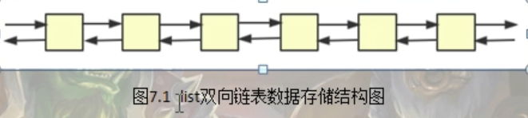
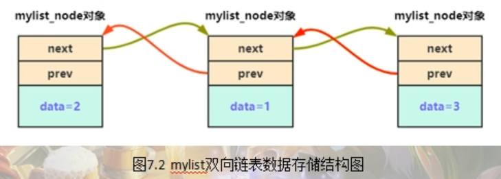
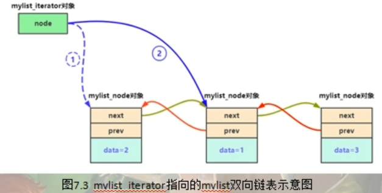
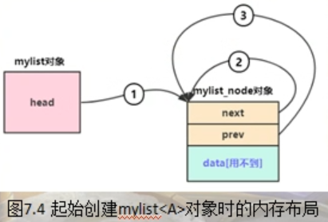

STL标准模板库代码

---

STL（标准模板库），它本身是包含在c++标准库中的，是使用模板与泛型编程开发的一个库，这个库中的各种接口，比如说容器，迭代器等等，在c++的开发中都是经常能使用到的。

# list容器的简单实现

c++中常用的容器有 vector, list, map等，他们有一个特点就是用来容纳同类型的多个元素

list容器它是一个双向链表，他的数据存储结构大致如下



```c++
namespace _nmsp1
{
    
    void func()
    {
        std::list<int> maglist;
        maglist.push_back(1);   // 末尾插入1，list容器中的内容是 1
        maglist.push_front(2);  // 开头插入2，list容器中的内容是 2，1
        maglist.push_back(3);   // 末尾插入3，list容器中的内容是 2，1，3
        
        for(std::list<int>::iterator iter = maglist.begin(); iter != maglist.end(); ++iter)
        {
            std::cout << *(iter) << std::endl;
        }
    }
}
```


## 基础代码



```c++
namespace lis
{
    template<typename T>
    struct mylist_node
    {
        mylist_node* next;  // 指向下一个元素的指针
        mylist_node* prev;  // 指向上一个元素的指针
        
        T data;     // 保存数据
    };
    
    // 容器和迭代器是密不可分的，迭代器一般是用于遍历容器中的元素，迭代器从理解角度，
    // 可以看做指向元素的指针（或者理解成迭代器是模拟指针的动作），实际上迭代器他不是一个指针，
    // 迭代器本身他也是一个类模板
    // 为mylist定义一个迭代器 mylist_iterator
    template<typename T>    // T代表容器中的元素类型
    struct mylist_iterator
    {
        // 为了防止一些隐式类型转换导致隐含的错误，写构造函数的时候全部用explicit来修饰
        // 默认构造函数
        explicit mylist_iterator() : node(nullptr){} 
        
        // 构造函数
        explicit mylist_iterator(mylist_node<T>* tmpv) : node(tmpv) {}
        
        // 基本接口，返回迭代器所指向的元素的引用
        T& operator*()
        {
            return node->data;
        }
        
        // 基本接口2，++ -- 让迭代器往前走和往后走
        // 重载前置 ++ (++iter)
        mylist_iterator& operator++()
        {
            node = node->next;  // 指向容器mylist中的下一个元素
            return *this;   // 这句代码的含义是返回 mylist_iterator这个对象本身
            // 但是因为我们上面不是重载了 * 嘛，有的人可能会认为，这里这个 * 被重载了，那这里是不是return 的 就是 T&
            // 其实并不是这样，因为对于 return *this, 这种代码行，因为在 这个从在函数里
            // 即 operator++这个代码行返回的是一个 mylist_iterator& (迭代器类型引用)
            // 所以编译器在处理这个代码行的时候很聪明，他知道这个 return *this,这个代码中的 *
            // 不应该被解析为 重载后的 *, 否者你返回类型他就不会是 mylist_iterator& 了，而是 T&
        }
        
        // 重载后置 ++ （iter++） ,后置++重载，圆括号中加一个int，以区别前置
        mylist_iterator operator++(int)
        {
            
            // 针对这行代码，编译器在处理的时候，首先会认为要调用mylist_iterator的拷贝构造函数来生成tmp对象
            // 所以这里的*依旧不会被解析为重载之后的*,这里的*this依旧会被解析为mylist_iterator对象本身
            mylist_iterator tmp(*this);
            node = node->next; // 当然这里也可以写成 ++*this；但是这样写的话就会调用重载的前置++
            // ++*this;
            return tmp;
            
            
            // 所以从这个写法上来看，后置++会生成一个临时对象，然后返回这个临时对象，但是前置++没有这个问题
            // 前置++不产生临时对象，所以遍历的时候提倡使用前置++
        }
        
        mylist_node<T>* node;  // 定义一个指向容器元素的指针
    };
    
    template<class T>
    class mylist
    {
    public:
        using iterator = mylist_iterator<T>;    // 迭代器类型
    };
    
    
    
}
```



## 插入新元素前的准备

设想一下，有一个整形变量 2,要加入到mylist容器中来，在整个的这个mylist双向链表中，就会多出一个被链入到这个链表中的mylist_node对象，并且最重要是是被链入的mylist_node对象 的data这部分的值代表的正是要加入的这个元素 2，所以就需要根据这个整形变量2来初始化一个mylist_node对象，也就是说我们需要为mylist_node这个类模板增加一个构造函数




> lis::mylist<A> msglist;

从这个图不难看到，msglist这个对象刚定义出来的时候，因为上面这行代码会执行mylist的构造函数，那么在mylist的构造函数中，它是用new在堆中创建了一个 `mylist_node<T>`这么一个对象，但是记住，这个对象可并不是用来保存任何mylist容器中的元素，这个对象虽然不保存任何mylist元素，但是他是有特殊地位的，在后续往mylist容器中插入元素的时候，这个对象的特殊地位就慢慢体现出来了。

同时，mylist对象有一个head成员，这个head成员指向的就是上面我们new出来的这个mylist_node对象。即head指向的这个mylist_node自己，然后next,prev也都是指向这个mylist_node自己

## 插入新元素

## 释放容器中元素所占用的内存